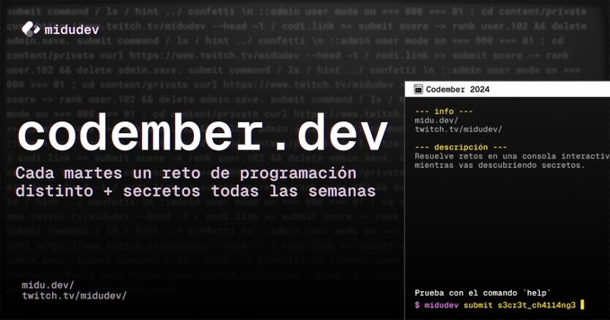

# Codember 2024

Realizo los retos de **[Codember](https://codember.dev)** (Juego con retos de programación y lógica.) creados por [Miguel Ángel Durán _"midudev"_](https://midu.dev).

## Progreso

- Retos completados: 5 de 5
- Retos secretos descubiertos: 13 de 13
- Logro supremo: 👍

## Changelog

- **28 Nov 2024** - Reto 5 y logro supremo completados.
- **28 Nov 2024** - Reto 4 completado.
- **27 Nov 2024** - Secreto 13 descubierto.
- **27 Nov 2024** - Secretos 11 y 12 descubiertos.
- **19 Nov 2024** - Reto 3 completado. 10 secretos descubiertos.
- **14 Nov 2024** - Retos 1 y 2 completados. 6 secretos descubiertos.

## Soluciones

| #   | Desafío                                                                 |
| --- | ----------------------------------------------------------------------- |
| 01  |  [Terminal desbloqueada](reto01/index.js) |
| 02  |  [Estamos en peligro](reto02/index.js)    |
| 03  | 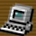 [Siguiendo la pista](reto03/index.js)    |
| 04  |  [Problemas de red](reto04/index.js)      |
| 05  |  [Terminator](reto05/index.js)            |

## Secretos

- S01.- ¡Multiverso a salvo!
- 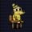S02.- ¿Todo estará bien?
- 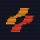S03.- Konami Code
- 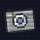S04.- Observador Innato
- 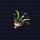S05.- Confetti lanzado
- 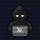S06.- Hacker eliminado
- 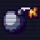S07.- Invocador del Caos
- 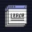S08.- Error inesperado
- 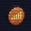S09.- Admin ejemplar
- 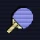S10.- Ping Pong
- 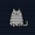S11.- MiduGato
- 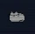S12.- miau
- 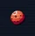S13.- mars.codes

## Supremo

- 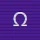¡Has logrado vencer a ΩMEGA!
